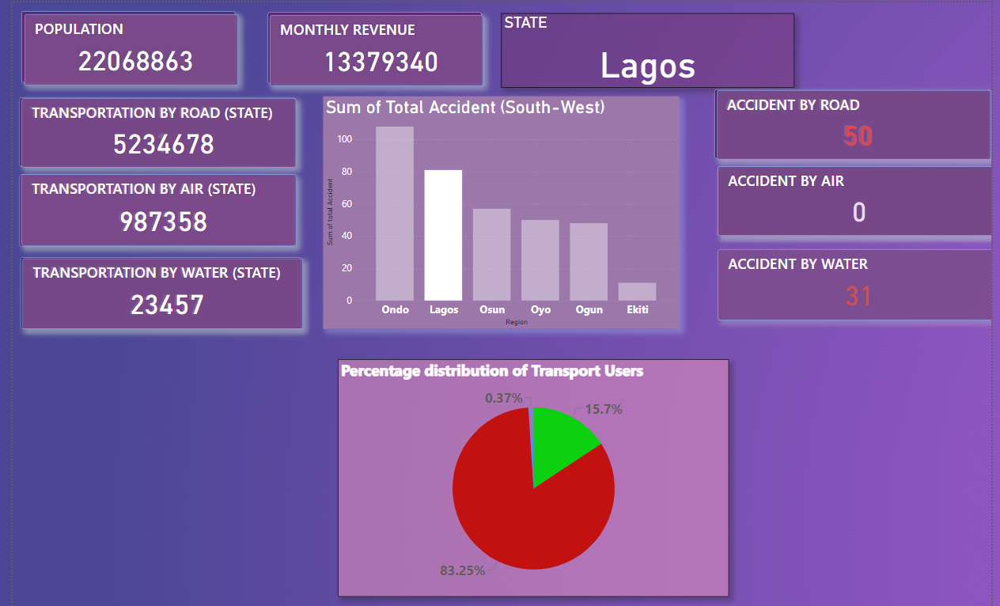

# FCB-TRANSPORTATION PROJECT 2020-DOCUMENTATION
## Project Outline 
This Data Analysis project aims to generate insight into our Logistics safety Clearance a model leading to transportation analysis performance for the year 2020. By analysing the various parameters in the data received we seek to gather enough insight to make reasonable decision which then enable us to tell Compelling stories around our data from the insight gotten from research and to know the trends from our data which users can interact with to get their own Logistics Safety clearance to know how to apply to transport goods, passengers.
# Data Description
The Datasets include the following fields:

-Region: Statistics for State insight on Transportation  

-Transport by Air: Binary Survey of Air Transportation per Region

-Transport by Road: Binary Survey of Road Transportation per Region

-Transport by Water: Binary Survey of Water Transportation per Region

-Transport by Rail: Binary Survey of Rail Transportation per Region

-Population: Statistics for Number of Individuals in Region & Country

-Yearly Revenue: Statistics for Profit generated from Transportation in Region & Country

-Accident by Road: Statistics for Accidents by Road in Region & Country

-Accident by Air: Statistics for Accidents by Air in Region & Country

-Accident by Water: Statistics for Accidents by Water in Region & Country

-Accident by Rail: Statistics for Accidents by Rail in Region & Country

-Usage by Road: Statistics for Road transportation Usage in Region & Country

-Usage by Air: Statistics for Air transportation Usage in Region & Country

-Usage by Water: Statistics for Water transportation usage in Region & Country

-Usage by Rail: Statistics for Rail transportation in Region & Country

# Data Visualization 
## Methodology
## Data Sources
The primary source of Data is xsls. And this is a closed source data that we are developing for our users to get in-touch with as the Data-informing Insight for trends in order to apply logistics, the Datasets are being modelled and Simulation occurs in the Data Visualisation tool used. I am open to working with partners in collaborative businesses for insights and more years On-Demand.

## Tools Used
Ms Excel [Download here](www.microsoft.com) 
- Was Used by me to Record and Populate the Datasets
## Data Visualization Tool
Microsoft PowerBi [Download here](www.microsoft.com/en-us/power-platform/products/power-bi)
- Was used by me to Visualize the Data
- Also used for transforming the datasets to a Data-informing-insight
 

## Data Manipulation
Data Transformation:
-Data Types and Formatting: Ensured all data fields were assigned the correct data types, with numerical fields formatted as currencies where appropriate, and date fields set to date format.
-Sorting: Sorted the dataset by the Date column to organize transactions chronologically.

 Data Cleaning: 
-Checked for Spelling Errors, Duplicate Values, and Blank Cells: Ensured data quality by correcting any spelling errors, removing duplicate entries, and addressing missing values

## Dashboard Overview

## •General Data Visualization for South Western Nigeria Transport System  
The Dashboard above is the Model which tells for the insight on South Western states transportation insights in Nigeria(Road, Rail, Air, and Water) Therefore models are chosen to represent the operations and working of a particular system of interest. One purpose of modelling is to enable the analyst predict the effect that certain changes will have on a system. Modelling is the process of representing a system with a specific tool to study its behavior. Simulation can then be a good alternative concept to evaluate the system behavior very close to reality usually through a computer. Simulation entails the following:
1. Build it and see if it works out?(Gather Actionable data in the Database)
2. Simulate current, expanded operations( many other issues along the way can also be investigated and evaluated cheaply and quickly).
   ## INSIGHTS
    |Nigeria population is 5,600,000 |72581760                       |
   |---------------------------------------------------|------------------------|
     | Transportation by Road(States) 3245871  | Accidents by Road in Ondo occurred 100 times
     |---------------------------------------------------|------------------------|
    | Transportation by Air(States) 400000 |  Accidents by Air in Ondo occurred 0 times
   |---------------------------------------------------|------------------------|
   | Transportation by Water(States) is unavailable |  Accidents by Water in Ondo occurred 8 times
   |---------------------------------------------------|------------------------|
          | COST OF TRANSPORTATION | COST OF TRANSPORTATION |
   |---------------------------------------------------|------------------------|
     | Transportation by Air is on a Highest scale of Cost |  very expensive
   |---------------------------------------------------|------------------------|
    | Transportation by Road is on a Moderate scale of Cost |  Affordable
   |---------------------------------------------------|------------------------|
    | Transportation by Water is on a Mildly high scale of Cost |  Mildly Affordable
   |---------------------------------------------------|------------------------|
  ---

## •Distinctive Data Visualization for South Western Nigeria Transport System  
The use of models that are adequate for an intended projects can lead to inexpensive redesign at late stages in the development of a system.
This model easily validates the process of this project as we simulate through:
1. General Data Visualization for Nigerian Transport System
2. Distinctive Data Visualization for Nigerian Transport System  

 ## INSIGHTS
   

