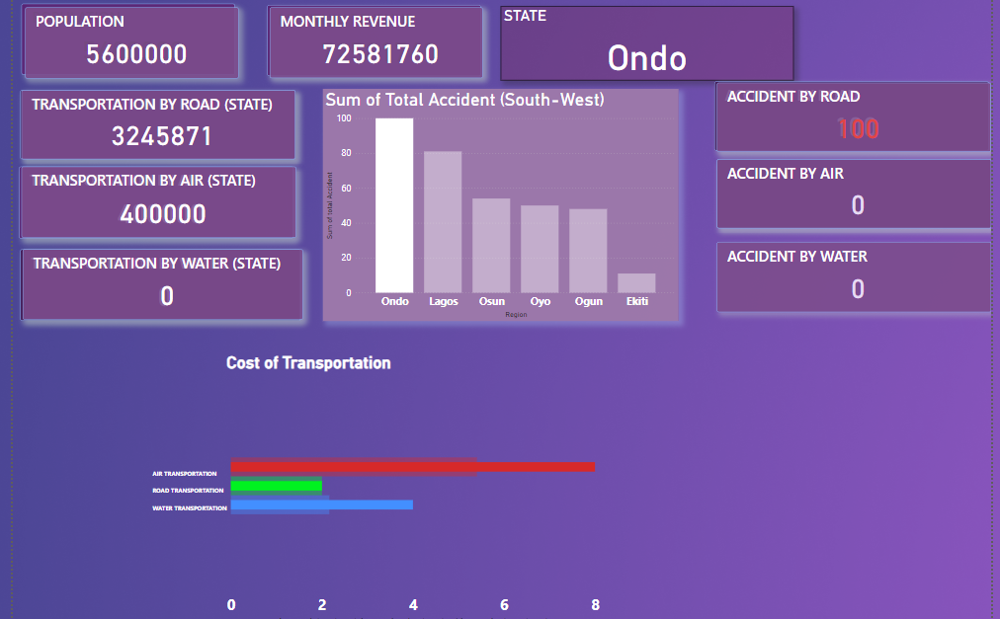

# FCB-PROJECT-DOCUMENTATION
## Project Outline 
This Data Analysis project aims to generate insight into our Logistics safety Clearance a model leading to traansportation analysis performance for the year 2020. By analysing the various parameters in the data received we seek to gather enough insight to make reasonable decision which then enable us to tell Compelling stories around our data from the insight gotten from research and to know the best performance from our data which users can interact with to get their own Logistics Safety clearance to know how to apply to transport goods, passangers.
## Data Sources
The primary source of Data is xsls. And this is an open source data that we are developing for users to get in-touch with for decision making trends in order to apply logistics, the Datasets are being modelled and Simulation occurs in the Data Visualisation tool used. I am open to working with partners in collaborative businesses for insights and more years On-Demand.

## Tools Used
•Ms Excel [Download here](www.microsoft.com)
---

## Data Visualization Tool
•Microsoft PowerBi [Download here](www.microsoft.com/en-us/power-platform/products/power-bi)
---
# Data Visualization 

## •General Data Visualization for Nigerian Transport System  

