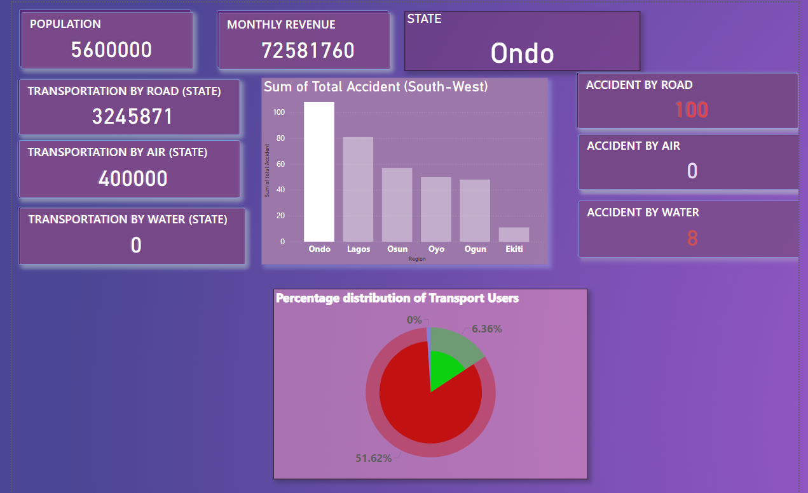

# FCB-TRANSPORTATION PROJECT-DOCUMENTATION
## Project Outline 
This Data Analysis project aims to generate insight into our Logistics safety Clearance a model leading to transportation analysis performance for the year 2020. By analysing the various parameters in the data received we seek to gather enough insight to make reasonable decision which then enable us to tell Compelling stories around our data from the insight gotten from research and to know the best performance from our data which users can interact with to get their own Logistics Safety clearance to know how to apply to transport goods, passangers.
## Data Sources
The primary source of Data is xsls. And this is a closed source data that we are developing for users to get in-touch with for decision making trends in order to apply logistics, the Datasets are being modelled and Simulation occurs in the Data Visualisation tool used. I am open to working with partners in collaborative businesses for insights and more years On-Demand.

## Tools Used
•Ms Excel [Download here](www.microsoft.com)
---

## Data Visualization Tool
•Microsoft PowerBi [Download here](www.microsoft.com/en-us/power-platform/products/power-bi)
---
# Data Visualization 

## •General Data Visualization for Nigerian Transport System  
The Dashboard above is the Model which tells for the insight on Nationwide Transport Logistics(Road, Rail, Air, and Water) Therefore models are chosen to represent the construction and working of a particular system of interest. One purpose of modelling is to enable the analyst predict the effect that certain changes will have on a system. Modelling is the process of representing a system with a specific tool to study its behavior. Simulation can then be a good alternative concept to evaluate the system behavior very close to reality usually through a computer. Simulation entails the following:
1. Build it and see if it works out?
2. Simulate current, expanded operations( many other issues along the way can also be investigated and evaluated cheaply and quickly).
   ## INSIGHTS
   |Nigeria population is 241,786,715 |
   |---------------------------------------------------|
     | Transportation by Road in 37 Available States |
     |---------------------------------------------------|
    | Transportation by Air in 25 Available States |
   |---------------------------------------------------|
   | Transportation by Water in 13 Available States |
   |---------------------------------------------------|
     | Transportation by Rail in 18 Available States |

